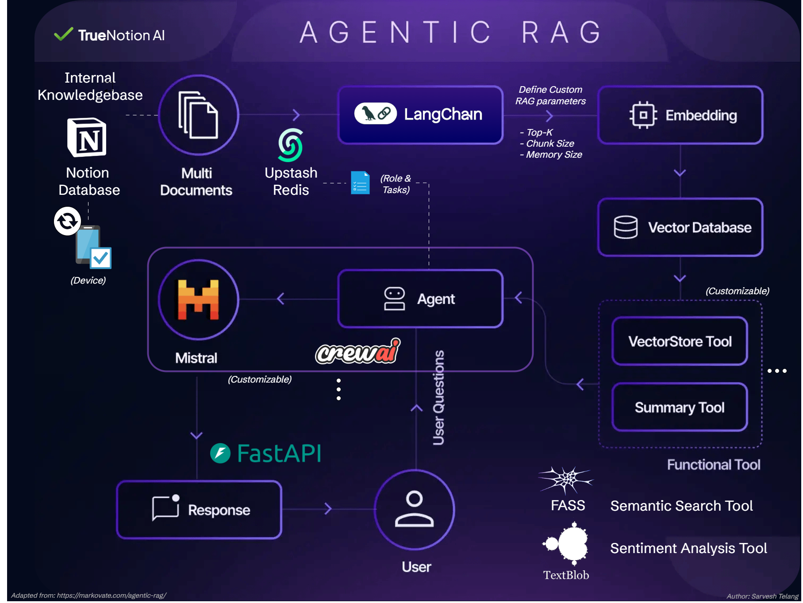

<p align="center">
  
</p>

<p align="center">
  <a href="https://www.apache.org/licenses/LICENSE-2.0">
    
  </a>
  
  
  
  
  
  
  
  
  
  
  
</p>

***>> Visit [https://truenotionai.github.io/](https://truenotionai.github.io/) <<*** 
– Added my portfolio and a sample Notion database as RAG context, which can be controlled remotely through Syncing Notion & Upstash cloud.

* An open-source AI project built on **Agentic RAG framework, Crew AI & Langchains** designed to Connect, Customize, and Control your intelligent workflows.**
* **Sync with Notion databases in real-time**, integrate powerful agentic RAG pipelines in your daily decisions.
* **Remotely access & configure agents, tasks, memory, accuracy, context, and retrieval parameters** through cloud— all while maintaining full data privacy & security.**

Customize with **any Crew AI supported LLM service** (Currently using Mistral as default)

Versatile framework offers a ready-to-use template for crafting any AI pipeline, from sentiment analysis to data aggregation, supporting a broad spectrum of vector embeddings like GloVe, all-MiniLM-L6-v2, Word2Vec, LLaMA, and APIs such as Cohere and DeepInfra.

Ideal template for orchestrating intelligent Multi-agent workflows across diverse applications—such as web customer service chatbots**, domain expert systems**, sales profiling, web scraping bots, dynamic report generation, business scheduling, and financial planning—all powered by scalable, cloud-hosted LLMs like Mistral.

***Refer repository [True-Notion-AI-Backend-Server](https://github.com/SarveshBTelang/TrueNotion-AI-Backend-Server) for ready to deploy code with Docker file***

Author: [Sarvesh Telang](https://www.linkedin.com/in/sarvesh-telang-17916448/)

---

<p align="center">
  
</p>

---

## ⭐ Key Features

- **Fully Open Source:** Apache 2.0 licensed and free to extend (**Attribution Required**)
- **Modular Agents:** Easily configurable with CrewAI.
- **Data Ownership:** Full control of models, storage, and flow.
- **Notion Integration:** Use Notion as a structured data backend.
- **Prebuilt AI Assistant:** Plug-and-play example for common use cases.
- **Customize with adding NLP Tools:** Sentiment, semantic analyzers, web crawlers (TextBlob, FAISS, Serper etc.).
- **Cloud-Ready Deployment:** Works with Vercel, Render, Railway, etc.

---

## How it Works:

- **Extract insights from Notion notes:** Sync personal or business documents into a Notion database that form the base of your **internal knowledge context**.
- **Memory Routing via Upstash Redis:** Stores document/task metadata to support fast lookup, secure and persistent data retrieval.
- **Chunking & Embedding (LangChain):** Documents are split into RAG-optimized chunks with configurable top-K, chunk size, and memory (last N conversations).
- **Vectorization & Semantic Retrieval:** Uses local or API-based vector embeddings and indexes them into a **Vector Database** like FAISS/ GloVE/ Word2Vec/trtai etc.
- **Tool Creation:** Tools such as Sentiment analysis, VectorStoreTool, Web-search tools could be created based on the application or context and reused across different AI agents.
- **Multi-Agent Orchestration with CrewAI:** Starts with a **Knowledge Analyst** agent and is easily extendable with Web Search Agents (Serper), Sentiment Analyzers, and Domain Experts (e.g., Finance, Sales).
- **Response Generation via LLMs:** Uses **Mistral** or plugin-based LLM APIs supported with Crew AI with concurrent multi-model support for tailored responses.
- **FastAPI Backend + Frontend:** Backend manages routing and conversations, with a frontend: Deployable on GitHub Pages, Vercel, or free tier platforms like Render, Railway, Koyeb, Fly.io etc.

---

## 🚀 Get Started

```bash
# 1. Fork the repository and clone it under your username
git clone https://github.com/SarveshBTelang/True-Notion-AI.git
cd True-Notion-AI

# 2. Install dependencies (Backend)
pip install -r requirements.txt

# 3. Set up environment variables

# NOTION DATABASE ID
Log in to your Notion account, Create a Database, Note down its ID from the browser URL.
The term before "?" is your database ID
https://www.notion.so/👉1f088b77abf28060xxxxxxxxxxxxxxxx👈?v=xxxxxxxxxxxxxxxxxxxxxxxxxxxxxxxx

# NOTION INTEGRATION TOKEN
Go to https://www.notion.so/profile/integrations, Log in to your Notion account, Select your workspace with created database and generate token
Note: Ensure the database is connected to your token by checking the "Connections" tab in Database settings.

# UPSTASH REDIS REST URL & REST TOKEN
Log in to your Upstash Redis account: https://console.upstash.com/login
Create Database and retrieve both REST URL and TOKEN under Python from "REST API" tab

# MISTRAL API (or any custom supported LLM for Crew AI agents)
Generate your Mistral API key at https://console.mistral.ai/api-keys
Note: For using custom LLM, configure your LLM code in /agents/load_default_agent.py
For more details on model support, visit https://docs.crewai.com/concepts/llms

# Save all the API keys in .env file
See .env-example.txt for more details

# 5. Run the app
You can run the app with python without deploying it on frontend:

python main.py   (standalone mode for testing)

uvicorn app:app --reload   (with fast api backend server)

# 6. Deploy your app
Refer repo [True-Notion-AI-Backend-Server](https://github.com/username/repo-name)

# 6. Install dependencies (Frontend)
cd frontend --> npm install

Configure your backend domain at:
frontend/src/service/backend_domain.js

npm run dev
```
---

This project is licensed under the Apache License 2.0 - see the [LICENSE](LICENSE) file for details.